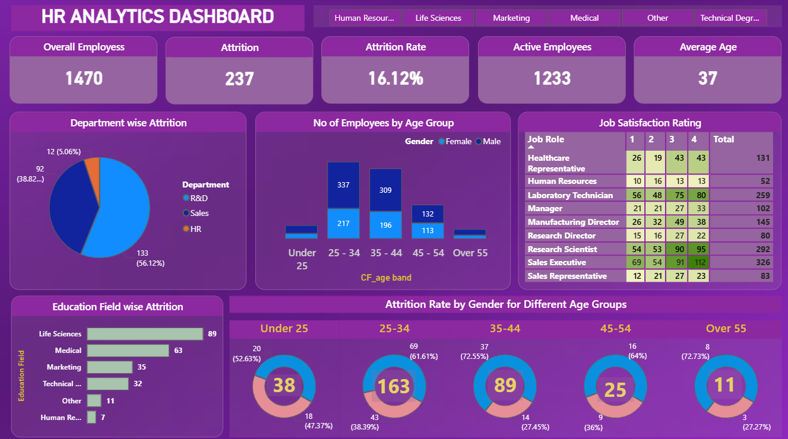

# 📊 HR Analytics Dashboard (Power BI)


> A professional HR analytics solution that transforms raw workforce data into actionable business insights using Power BI.

---

## 🖼️ Dashboard Preview



---

## 📄 Project Report

A detailed technical and business report is available for deeper understanding.

📥 [Download Full Project Report (PDF)](hr_dashboard_report.pdf)

---

## 🎯 Key Objectives

- Analyze employee attrition patterns across departments and demographics  
- Understand workforce age and gender distribution  
- Evaluate job satisfaction scores across roles  
- Identify high-risk segments for employee turnover  
- Support strategic HR decision-making using data  

---

## 📊 Key Metrics

| Metric | Description |
|--------|-------------|
| Employee Count | Total number of employees in the organization |
| Attrition Count | Number of employees who left |
| Attrition Rate | Percentage of workforce lost |
| Active Employees | Current active headcount |
| Average Age | Mean age across the workforce |

---

## 📈 Dashboard Features

### 📌 KPI Cards
Five headline cards provide an instant snapshot — Employee Count, Attrition Count, Attrition Rate, Active Employees, and Average Age.

### 📊 Visual Analytics
- Pie Chart — Attrition breakdown by Department  
- Column Chart — Employee count by Age Band and Gender  
- Bar Chart — Attrition count by Education Field  
- Donut Charts — Attrition segmented by Gender and Age Band  
- Matrix Table — Job Satisfaction ratings across Job Roles  

### 🎛️ Interactivity
- Education Field slicer for dynamic filtering across all visuals  
- Cross-filtering by clicking any chart segment  
- Hover tooltips for granular data points  

---

## 🧠 Key Insights

> ⚠️ Replace placeholders with actual dashboard values before publishing.

- The **[X] department** accounts for the highest share of attrition at **[X]%**  
- Employees in the **[age band]** group show the highest turnover rate  
- **[Education field]** backgrounds are disproportionately represented in attrition  
- Job satisfaction is lowest among **[Job Role]**, correlating with higher exits  
- Overall attrition rate stands at **[X]%** against an active workforce of **[X]**  

---

## 🛠️ Tech Stack

| Tool | Usage |
|------|------|
| Power BI Desktop | Dashboard development |
| Power Query | Data cleaning & transformation |
| DAX | Measures and KPIs |
| Data Visualization | Charts and storytelling |

---

## 🗂️ Project Structure

```
hr-dashboard-powerbi/
│
├── hr_dashboard_power_bi.pbix   # Power BI report
├── hr_dashboard.png             # Dashboard preview
├── hr_dashboard_report.pdf      # Project documentation
└── README.md                    # Project overview
```

---

## ⚙️ How to Run This Project

1. Clone or download this repository  
2. Open Power BI Desktop  
3. Go to File → Open Report → Browse  
4. Select `hr_dashboard_power_bi.pbix`  
5. Use slicers and visuals to explore insights  

> Note: Dataset is embedded inside the `.pbix` file (no external database required)

---

## 📌 Business Value

- Reduce employee attrition using data-driven insights  
- Improve workforce planning and HR strategy  
- Identify high-risk departments and roles  
- Enhance employee satisfaction analysis  
- Support executive decision-making with KPIs  

---

## 🚀 Future Improvements

- Predictive attrition modeling (Machine Learning)  
- Time-series workforce trend analysis  
- Drill-through department dashboards  
- Real-time HR data integration  
- Role-based dashboards for HR management  

---

## 🙋 About This Project

Built to demonstrate practical skills in **Power BI, HR Analytics, and Data Visualization**.

📬 Connect on LinkedIn:https://www.linkedin.com/in/minnanourin/
dex=2}
